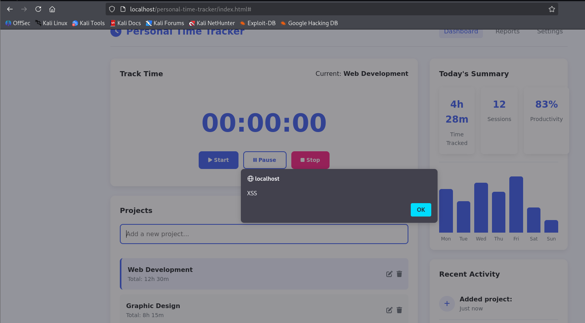

# Reflected Cross-Site Scripting (XSS) in Personal Time Tracker V1

## Summary
The **Personal Time Tracker** web application is vulnerable to **Reflected Cross-Site Scripting (XSS)** in the project name input.  
An attacker can inject malicious JavaScript code that executes immediately in the victim’s browser.

*Source Code:* [Time Tracker V1](https://www.sourcecodester.com/javascript/18346/personal-time-tracker-using-html-css-and-javascript-source-code.html)

---

## Vulnerability Details
- **Affected Application:** Personal Time Tracker  
- **Affected File:** `index.html` / `script.js`  
- **Vulnerability Type:** Reflected Cross-Site Scripting (XSS)  
- **Attack Vector:** Remote (user input in form field)  
- **CWE:** [CWE-79: Improper Neutralization of Input During Web Page Generation (‘Cross-site Scripting’)](https://cwe.mitre.org/data/definitions/79.html)  

### Root Cause
User input is directly reflected into the DOM via `innerHTML` without sanitization:

```javascript
newProject.innerHTML = `
    <div class="project-info">
        <span class="project-name">${this.value}</span>
        <span class="project-time">Total: 0h 0m</span>
    </div>
    <div class="project-actions">
        <button class="icon-btn"><i class="fas fa-edit"></i></button>
        <button class="icon-btn"><i class="fas fa-trash"></i></button>
    </div>
`;
```

---

### Exploitation Proof of Concept (PoC)
#### Step 1 – Insert Malicious Payload

In the Project Name field, enter:

```javascript

```

#### Step 2 – Trigger Execution

Upon form submission, the payload is reflected back into the DOM.
The malicious script executes instantly in the user’s browser.

An alert box is triggered:




This confirms successful JavaScript execution.
